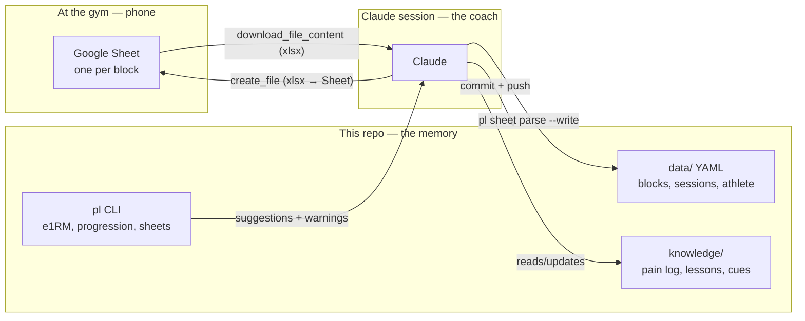

# Architecture

## The problem

Training knowledge was scattered: plans in Google Sheets, performance in
memory, pain history nowhere. Every new block started almost from scratch.
This system gives the coach (Claude) durable memory of **plans, performed
sets, pain patterns and lessons**, while keeping the gym-facing surface a
plain Google Sheet.

## Shape of the system



Mental model: **the Sheet is the paper logbook Claude prints for you; the
repo is the coach's filing cabinet; chat is the coach's voice.**

The sheet dialect intentionally matches the athlete's historical coach
template (HEAVY WEIGHT sheets): Spanish headers, RPE-first prescriptions,
one `Reps | Kg | RPE` triplet per performed set. Muscle memory transfers;
only the plumbing changed.

## Decisions

### Memory = git-tracked YAML, not a database server

A lifter's full history is tiny (a few thousand sets per year). Plain YAML:

- is readable and editable by both human and Claude with zero tooling,
- gets versioning, audit trail and sync for free via git,
- survives any future stack change (it's just text).

`pl` loads everything into memory in milliseconds; "queries" are Python.

### The graph is in the data, not in a graph database

The domain *is* a graph — and it's encoded relationally in the YAML:

```
Exercise --loads--> joints/muscles        (exercises.yaml)
Exercise --variation_of--> Exercise       (exercises.yaml parent:)
Session  --performed--> Exercise          (sessions/*.yaml)
Session  --part_of--> Block/Week          (sessions/*.yaml)
PainEvent --at--> location --maps--> joints --maps--> Exercises
PainEvent --during--> Exercise, Block     (pain-log.yaml)
```

The killer query — *"planned exercise loads a joint that has an open pain
event"* — is a two-hop join `pl suggest` does in a few lines. At this scale
a Neo4j/Kuzu server adds ops burden and zero capability. If multi-hop
exploration ever becomes a real need, [Kuzu](https://kuzudb.com) (embedded,
`pip install kuzu`, Cypher) can be fed from these same YAML files without
changing the source of truth.

### No RAG / embeddings

Retrieval here needs **exact numbers** ("best 3×5 squat in the last 60
days"), not semantic similarity. The dataset fits in context; Claude greps
and runs `pl` commands. Agentic search over structured text beats a vector
store for this shape and size of data.

### Google Sheets via the Drive connector, not the Sheets API

The claude.ai Google Drive connector already has auth. Two capabilities
close the loop (both verified end-to-end on 2026-07-19):

- **Write**: `pl sheet build` emits the block as CSV → `create_file`
  with `textContent` + `contentMimeType: text/csv` → Drive converts it
  to a native Google Sheet. (The connector rejects binary/base64 xlsx
  uploads, which is why CSV is the canonical format; the xlsx builder is
  kept for local previews.)
- **Read**: `download_file_content` with `exportMimeType: text/csv` →
  `pl sheet parse` turns it back into session YAML.

CSV means one tab per block with weeks stacked as `SEMANA n` sections —
which is exactly how the athlete's historical coach sheets were laid out.

Cost of this choice: Claude can't edit single cells of an existing Sheet —
so the design never needs to. A block sheet is **printed once**, logged
into at the gym, and read back. Weekly adjustments travel through chat.
If in-place edits or formatting ever matter, a Sheets-API service account
can be added later without touching the data model.

### Deterministic engine + judgment layer

Weight math lives in `pl` (testable, reproducible): Epley e1RM with RPE
credit, percent waves, double progression, plate rounding, pain-guardrail
warnings. Claude's job is the judgment the math can't do — interpreting
"knee felt weird", deciding to deload early, changing exercise selection —
and it must explain overrides in chat and record durable conclusions in
`knowledge/`.

## Data layout

```
data/
  athlete.yaml            profile, units, plate increment, known maxes
  exercises.yaml          catalog: muscles, joints, patterns, aliases (graph nodes)
  blocks/<block-id>/
    block.yaml            structure, schemes, days/slots, sheet file id
    sessions/YYYY-MM-DD-dayN.yaml   what actually happened
knowledge/
  pain-log.yaml           PainEvents (structured, drives guardrails)
  lessons.md              durable conclusions, dated, with evidence
  technique-cues.md       per-lift cues
```

## Future options (deliberately not built yet)

- **Kuzu graph mirror** for Cypher queries over the same YAML.
- **Sheets API service account** for in-place cell updates/dashboards.
- **Charts**: `pl` already computes e1RM history; a `pl report` command
  rendering an HTML artifact is a natural add.
- **Wearable/readiness import** (sleep, HRV) into `readiness:` on sessions.
